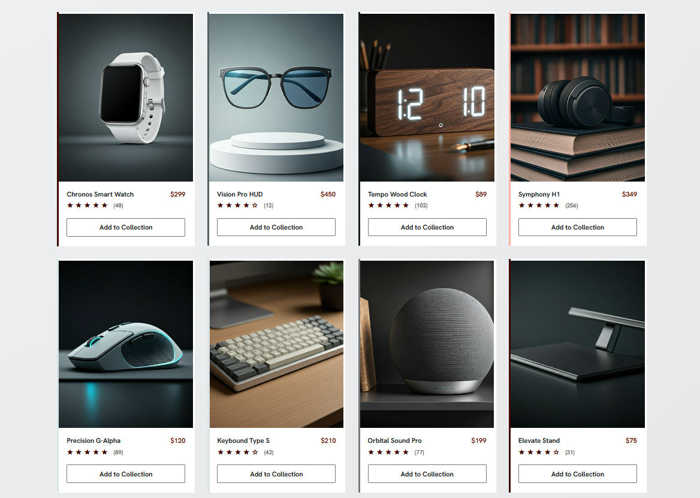
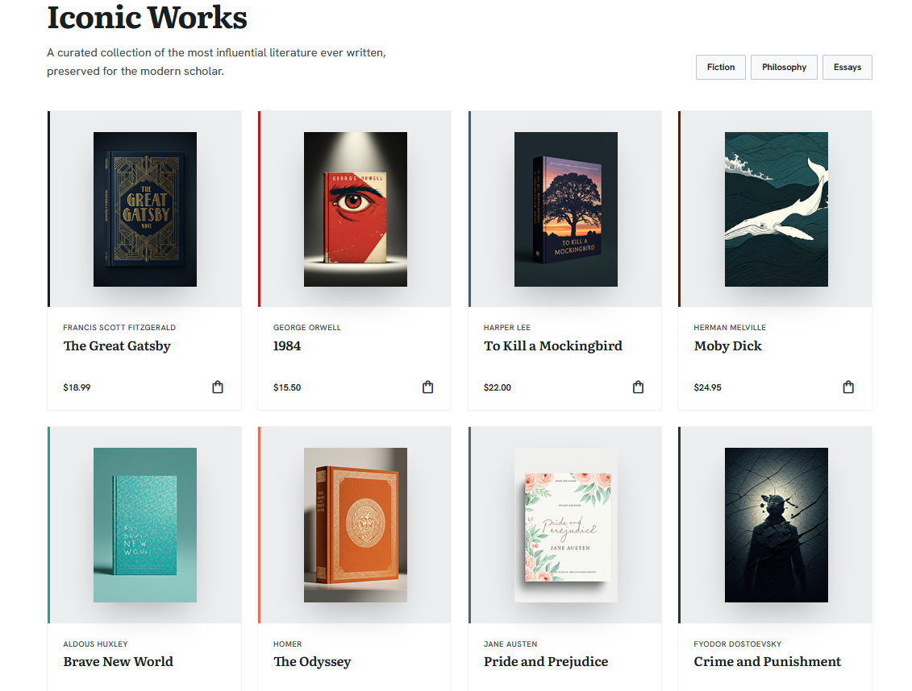
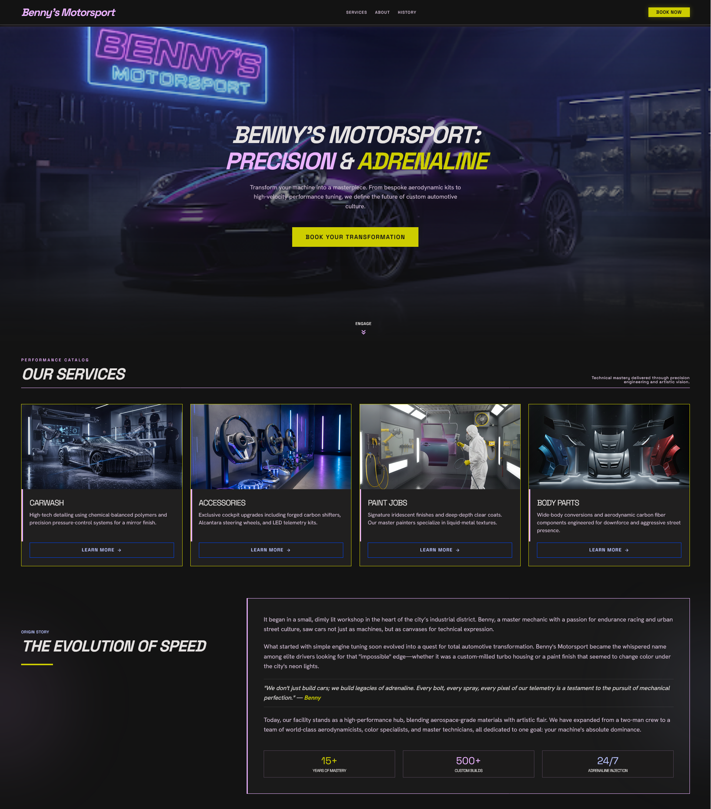
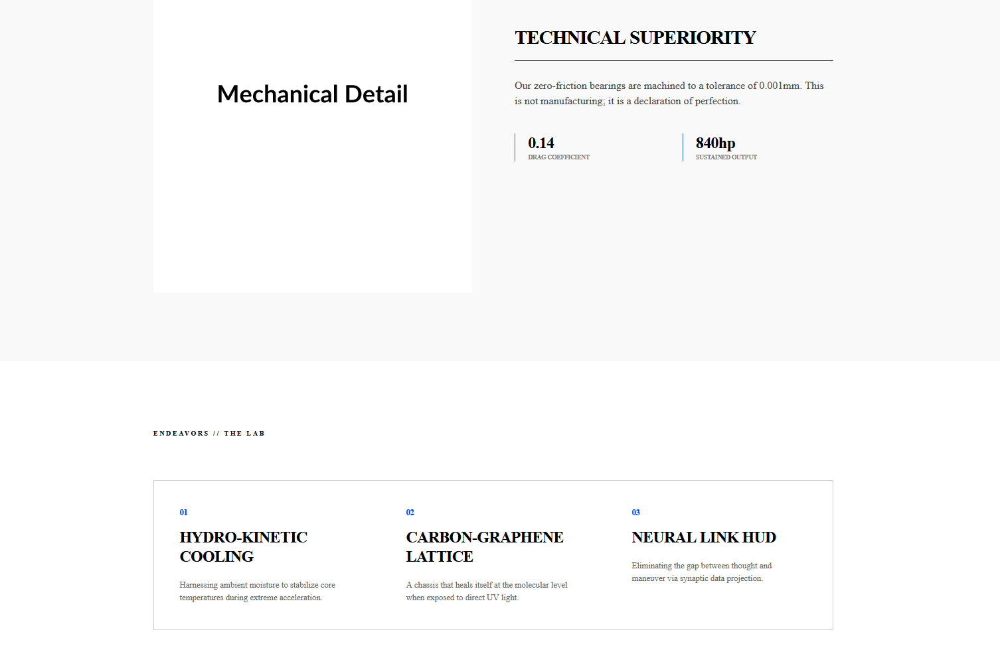

# 𓇻 Archival Design Pool — The Vault

> A curated, highly opinionated repository of eccentric, hyper-elegant, and editorial frontend layouts. Built for modern web applications, high-ticket product showcases, and boutique digital experiences.

---

## 𓋹 Philosophy

Most modern frontend component libraries suffer from the same affliction: *monotony*. They look like SaaS dashboards or generic templates. **The Vault** exists to break that mold. 

This repository houses a collection of layouts that treat web design like high-end editorial architecture—relying on **massive typography (Times New Roman Bold)**, asymmetric grid structures, deep kinetic whitespace, and sharp hairline dividers. It is a playground for explorers who prioritize digital craftsmanship and visual impact.

---

## 𓇚 Repository Architecture

The repository is organized into distinct design streams based on the framework and source material, making it easy to navigate and pull specific components:

```bash
├── 1) Stitch/               # Custom Stitch template ecosystem
│   ├── Retail_E-Commerce/   # High-fashion retail layouts
│   ├── Shop_Buy_Sell/       # Commercial and marketplace designs
│   ├── Showcase/            # Dynamic product & automotive showcases
│   ├── Service_Related/     # Editorial agency and service portfolios
│   └── Extras/              # Experimental snippets and micro-layouts
│
├── 2) Wordpress/            # Curated WordPress template source files
│
├── 3) Gemini Canvas/        # Bespoke designs engineered live using Gemini Canvas
│
└── 4) Extras_Custom/        # Miscellaneous custom layouts, sandboxes, and assets
```
---

## 𓃰 Core Layout Gallery

### 01 / Retail Architectural Archive (`Stitch/Retail_E-Commerce`)
* **Aesthetic:** High-fashion, light-themed, structural minimalism.
* **Core Stack:** Vanilla HTML, Tailwind CSS, Micro-Interactions script.
* **Key Features:** Layered overlapping text blocks, non-standard product cards, info-dense gallery grids, and a massive 5-column architectural footer.

<p align="center">


  </p>
*Figure 1: Desktop layout view highlighting asymmetric text overlays and the 1px architectural grid system.*

---

### 02 / Vortek Kinetic Showcase (`Stitch/Showcase`)
* **Aesthetic:** Vibrant-Luxe, illuminated dark theme with high-saturation chroma glows.
* **Core Stack:** Tailwind CSS, Custom Interactive Canvas Cursor.
* **Key Features:** Smooth infinite text marquee, technical data grids, and a glassmorphic endeavor list optimized for precision-engineered products.


*Figure 2: Dark mode preview showcasing interactive service related templates.*

---

### 03 / Classic Heritage Landing (`Gemini Canvas`)
* **Aesthetic:** "Old Money" editorial layout, clean off-white background paired with high-energy Electric Azure highlights.
* **Core Stack:** HTML5, Times New Roman Typographic Engine.
* **Key Features:** Pure typographic hierarchy, ultra-thin hairline dividers, and fluid layouts that discard standard component margins completely.
Created using Gemini In-Built Canvas Generation Tool .


*Figure 3: Light mode presentation illustrating high-contrast typography and razor-sharp separation rules.*

---

## 𓁎 Design Patterns Enforced

If you are planning to contribute a layout to this pool, please ensure it strictly follows our aesthetic guidelines:

1. **Typography Over Borders:** Rely on vast, deliberate font size variations to separate content before introducing lines.
2. **Hairline Precision:** When borders are absolutely necessary, use `0.5px` or `1px` max with low-opacity values (`rgba(0,0,0,0.08)`).
3. **Intentional Asymmetry:** Break the layout matrix. Let an element overflow, slide behind text, or push deep down a page using responsive spacing (`md:pt-32`).
4. **Vibrant Accents Only:** Keep backgrounds completely neutral (pure white, linen off-white, or midnight dark) and use a singular high-saturation accent color (e.g., Electric Blue, Cyan, or Neon Violet) to steer user interaction.

---

## 𓋔 Getting Started

Clone the repository and spin up a local server to view the entire showcase interactively.

```bash
# Clone this vault
git clone [https://github.com/hellmsman/archival-design-pool.git](https://github.com/hellmsman/archival-design-pool.git)

# Navigate into your layout collection of choice
cd archival-design-pool/
```

# Open directly in your browser or run via Live Server
open index.html
